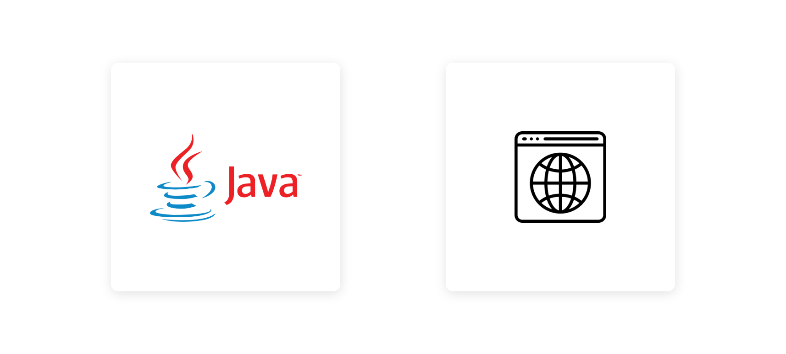

# Servlet CRUD

This is a very rudimental project implementing basic Create, Read, Update & Delete operations.



---

## Database
The project implements all operations on a MySQL Database, called 'Member' with the following structure:
```
+-------+--------------+------+-----+---------+-------+
| Field | Type         | Null | Key | Default | Extra |
+-------+--------------+------+-----+---------+-------+
| id    | int(10)      | YES  |     | NULL    |       |
| name  | varchar(100) | YES  |     | NULL    |       |
| email | varchar(100) | YES  |     | NULL    |       |
| age   | int(3)       | YES  |     | NULL    |       |
+-------+--------------+------+-----+---------+-------+
```

## Servlets
We can generate Dynamic Web Pages in Java using Java Servlet.
This project has 4 Servlets handling various functionalities:

- Save
- View
- Edit
- Delete

## Data Acess Object

This allows us to isolate the application/business layer from the persistence layer.
In this project 'MemberDao.java' is the class implementing this structural pattern.

It contains the following functions:

- getConnection
- save
- update
- delete
- getMemberById
- getAllMembers

Refer the comments in the code for further understanding.

## Entity

This is basically a class (Member.java) to model our data in the database, it contains methods to 'get' and 'set' the data into the object as well.

